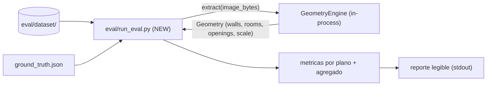

# ADR-012 — Harness de evaluación offline del motor CV

> Milestone: sin fecha objetivo | Feature: eval-harness

## Status
Accepted

## Context

El motor de extracción de geometría (OpenCV clásico, Fase 1) se ajusta hoy mediante parámetros por env vars (`settings.py`, familias `CV_UPSCALE_*`, `CV_CLEANUP_*`) calibrados empíricamente sobre imágenes normalizadas a 2000 px. Cada cambio de pipeline (limpieza de máscara, close asimétrico de rooms, OCR de cotas) se valida hoy mirando conteos sueltos (`walls 852→118, rooms 0→4`) anotados a mano en `project.md`. **No existe forma objetiva y repetible de saber si un cambio mejora o empeora la extracción** sobre un conjunto representativo de planos.

Fuerzas en juego:

- El motor es **determinista** (sin ML en Fase 1, ADR-008): la misma imagen produce siempre la misma geometría → una evaluación offline reproducible es viable sin fixtures probabilísticos.
- El servicio es **stateless** (ADR-002): no accede a S3, DB ni credenciales. Cualquier harness debe ser **tooling de desarrollo local**, nunca persistencia ni dependencia del servicio en runtime.
- El contrato REST (`cv-service.openapi.yaml`, ADR-003) **no debe cambiar** — el harness no introduce endpoints ni toca la API.
- **CubiCasa5K está vetado** (licencia CC BY-NC, prohibida para uso comercial): el dataset de evaluación es 100% propio.
- Las métricas de calidad de extracción son **continuas** (error relativo de área, conteos, score por plano), no binarias — encajan mal en el modelo pass/fail de pytest.
- El contrato HTTP ya está cubierto por `tests/test_api_suite.py`; el harness NO debe duplicar esa cobertura, sino medir **calidad geométrica**.

El motor se invoca hoy vía la interfaz `GeometryEngine` (`src/vitrina_cv/engines/base.py`), seleccionada por `CV_ENGINE` y construida con `get_engine(cv_engine)`. Esa misma interfaz es el punto de acoplamiento natural del harness.

Flujo previsto del runner:



## Decision

Se establecen las **convenciones durables** de un harness de evaluación offline, como tooling de desarrollo local dentro del mismo repo:

**1. Ubicación y estructura del dataset.** Un directorio `eval/` (NEW) en la raíz del repo, fuera del paquete `src/vitrina_cv/`:

```
eval/
  dataset/
    <plan_id>/
      image.png            # plano propio, PNG
      ground_truth.json    # anotación manual
  run_eval.py              # runner standalone
```

Cada `<plan_id>` es un directorio autocontenido (imagen + su ground truth). El dataset es 100% propio; CubiCasa5K queda excluido por licencia.

**2. Formato mínimo de `ground_truth.json`.** Contrato canónico mínimo viable — campos escalares transcritos a mano de las cotas del plano:

| Campo | Tipo | Semántica |
|---|---|---|
| `plan_id` | string | Identificador, coincide con el nombre del directorio |
| `expected_rooms` | integer | Nº de habitaciones esperadas |
| `room_areas_m2` | array de number \| null | Área esperada por habitación en m² (de las cotas); `null`/omitido si el plano no tiene escala |
| `expected_doors` | integer | Conteo aproximado de puertas |
| `expected_windows` | integer | Conteo aproximado de ventanas |
| `notes` | string (opcional) | Observaciones de anotación |

Invariante: los polígonos exactos por habitación son **opcionales/futuros** — no forman parte del mínimo viable. La ausencia de escala (`room_areas_m2` vacío) es válida y no invalida la anotación; simplemente desactiva la métrica de área para ese plano.

**3. Métricas que reporta el runner.** Por cada plano y en agregado:

- **Rooms detectados vs esperados** — diferencia entre `len(rooms)` de la geometría y `expected_rooms`.
- **Error relativo de área** — solo cuando el plano tiene escala (`scale.source != "none"` y `room_areas_m2` presente): `|area_detectada - area_esperada| / area_esperada`. Invariante: si no hay escala, la métrica se omite (no se reporta 0 ni se penaliza).
- **Falsos positivos** — rooms detectados por encima de los esperados.
- **Score por plano** — un valor agregado por plano que combine las métricas anteriores; la fórmula concreta es decisión de implementación del developer, no se prescribe aquí.

**4. Invocación del motor: in-process.** El runner importa y usa la interfaz `GeometryEngine` (vía `get_engine`/`extract`) en el **mismo proceso Python** — sin HTTP, sin levantar el servicio. Justificación: es determinista, no requiere infra de red, y el contrato HTTP ya se valida aparte en `tests/test_api_suite.py`. El harness respeta ADR-008: usa la interfaz, nunca un motor hardcodeado.

**5. Forma de ejecución: script standalone, no pytest.** `eval/run_eval.py` se corre a demanda con `uv run`, produciendo un **reporte legible por humano** (stdout). NO es una suite pytest: las métricas continuas encajan mal en pass/fail. Un marker pytest podrá agregarse en el futuro si se necesita un umbral de regresión, pero queda **fuera del alcance** de este ADR.

**Qué NO es este harness (límites explícitos):**
- No es un servicio ni un endpoint — no toca `cv-service.openapi.yaml` (ADR-003).
- No introduce persistencia, S3, DB ni credenciales — es tooling local (ADR-002 intacto).
- No decide semántica (tipos finales de aberturas ni etiquetas de ambiente) — ADR-009 intacto.
- No define la estrategia de generalización (envelope Fase 1 / criterios de salto a motor ML): esa decisión queda **pospuesta** hasta tener un baseline medido con este harness.

## Consequences

**Positivas:**
- Existe por primera vez una medición objetiva y reproducible de la calidad de extracción; los cambios de pipeline se pueden comparar contra un baseline en vez de anotaciones sueltas a mano.
- Cero impacto en el runtime del servicio: el harness vive en `eval/`, no se empaqueta en la imagen del sidecar ni añade dependencias de red.
- Respeta todas las restricciones no negociables del servicio (ADR-002, ADR-003, ADR-008, ADR-009) por construcción.
- El formato mínimo de `ground_truth.json` baja la barrera de anotación: campos escalares transcritos de cotas, sin necesidad de trazar polígonos.

**Negativas / Trade-offs aceptados:**
- La anotación del dataset es **manual** y su cobertura inicial será pequeña; el valor del harness crece con el nº de planos anotados.
- Al medir contra área/cotas transcritas a mano, hay **error humano de anotación** que actúa como piso de ruido en las métricas de área.
- Sin polígonos exactos en el mínimo viable, la métrica de área compara agregados/aproximaciones, no geometría por habitación exacta; refinarlo queda para una iteración futura.
- La invocación in-process acopla el harness a la interfaz interna `GeometryEngine`: si esa interfaz cambia de firma, el runner debe actualizarse (aceptable — es tooling del mismo repo).

## Implementation notes

- **`eval/` (NEW)** — directorio en la raíz del repo, **fuera** de `src/vitrina_cv/`. Justificación de ubicación: es tooling de desarrollo, no código del paquete distribuible; separarlo de `src/` evita que se empaquete en el build (hatchling, src layout) y deja claro que no es parte del servicio desplegable. Los tests del servicio viven en `tests/`; `eval/` es un concern distinto (evaluación de calidad, no verificación de contrato).
- **`eval/run_eval.py` (NEW)** — runner standalone ejecutado con `uv run`.
- **`eval/dataset/<plan_id>/` (NEW)** — un directorio autocontenido por plano.
- Invariante de invocación: el runner selecciona el motor vía `get_engine(cv_engine)` respetando `CV_ENGINE`, nunca instanciando un motor concreto directamente (ADR-008).
- Invariante de escala: la métrica de error de área se computa únicamente cuando `scale.source != "none"` en la geometría devuelta **y** `room_areas_m2` está presente en el ground truth.
- Referencias cruzadas: ADR-002 (stateless), ADR-003 (contrato REST inmutable), ADR-008 (motor intercambiable), ADR-009 (sin decisión semántica).
- Decisión pospuesta (fuera de alcance): ADR de estrategia de generalización / criterios de salto a motor ML — a escribir una vez exista baseline medido.
