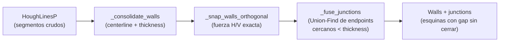
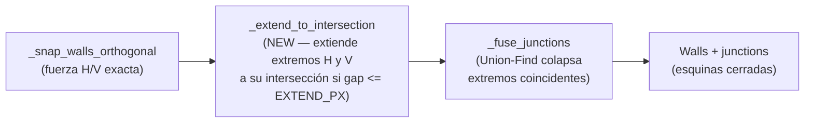

# ADR-013 — extend-to-intersection para cierre de junctions de muros

> Milestone: run 08-cv (fidelidad visual 2D) — inferido de la cadena de runs 07/08-cv | Motivado por: decisión puramente técnica del pipeline CV

## Status
Accepted

## Context

El pipeline de detección de muros del motor `OpenCVClassicEngine`
(`src/vitrina_cv/engines/opencv_classic.py`) produce, en su fase F4, segmentos
de muro (`Wall`) mediante la cadena:

```
HoughLinesP → _consolidate_walls() → _snap_walls_orthogonal() → _fuse_junctions()
```

- `_snap_walls_orthogonal()` (línea 1344) corrige sub-alineaciones angulares:
  segmentos con ángulo `< _SNAP_ANGLE_TOL_DEG` respecto de un eje se proyectan a
  horizontal o vertical exacta. No cambia la longitud del segmento, solo su
  inclinación.
- `_fuse_junctions()` (línea 1390) es un Union-Find que fusiona endpoints de
  muros distintos a su centroide cuando su distancia euclidiana es
  `< min(thickness_i, thickness_j)`. Con centerline habilitado
  (`cv_wall_centerline_enabled`, ADR referenciado en `settings.py`),
  `thickness ≈ 2×median(DT)`; el fallback es `_WALL_THICKNESS_EST_PX = 10px`.

**Causa raíz del defecto.** En planos ruidosos (achurado, muebles), la fase de
limpieza `mask_cleanup.retain_rectilinear` (kernel `cv_cleanup_rectilinear_len_px
= 150px`) elimina píxeles en las esquinas — la nota de esa constante en
`settings.py` lo reconoce explícitamente: a resolución nativa alta "removes valid
junction corner pieces that are critical for room-boundary closure". Sin esos
píxeles de esquina, `HoughLinesP` produce segmentos que terminan **cortos**, con
un gap de 20–40px antes de la esquina geométrica. El resultado visual: muros que
no se unen en las esquinas del render 2D.

`_fuse_junctions` **no puede reparar este caso**: solo fusiona endpoints que ya
están cercanos entre sí (dentro de `thickness`, típicamente < 20px). Cuando el
gap supera el thickness, cada endpoint queda como singleton (`< _JUNCTION_MIN_
CLUSTER_SIZE`) y no se genera junction. La fase no extiende geometría, solo la
colapsa.

El caso sintético **plan-004 no presenta el problema** — sus muros llegan
completos a las esquinas — por lo que cualquier solución debe ser un no-op sobre
él (gaps nulos → sin extensión).

**Pipeline actual (antes):**



## Decision

Insertar una fase pura **`_extend_to_intersection()`** (NEW) entre
`_snap_walls_orthogonal` y `_fuse_junctions`, controlada por una nueva env var
`CV_JUNCTION_EXTEND_PX` (default `40`, sobre imagen normalizada a ~2000px):

```
_snap_walls_orthogonal() → _extend_to_intersection() → _fuse_junctions()
```

Se elige extend-to-intersection sobre las alternativas por ser la única que ataca
la causa raíz (geometría faltante en la esquina) sin degradar el filtrado de
ruido que hace posible detectar los muros en primer lugar.

**Alternativas consideradas:**

- **(a) Aumentar `HOUGH_MAX_GAP` (maxLineGap de HoughLinesP).** Pro: cambio de un
  solo parámetro. Contra: HoughLinesP une colinealmente sobre el mismo eje — no
  cierra esquinas ortogonales (H con V), que es precisamente el caso. Además un
  gap mayor fusiona muros paralelos separados por aberturas (puertas/ventanas),
  corrompiendo la detección de openings aguas abajo. Descartada: no resuelve el
  caso ortogonal y regresiona openings.
- **(b) Relajar el diagonal filter (`cv_wall_diagonal_filter_*`).** Pro: recupera
  algún píxel de esquina. Contra: el filtro diagonal existe para descartar
  escaleras y puertas seccionales (~45°); relajarlo reintroduce esos falsos muros.
  Ortogonal al problema (los gaps de esquina no son un problema de ángulo, sino de
  longitud). Descartada: no toca la causa raíz y regresiona el filtrado 08-cv-01.
- **(c) `_extend_to_intersection()` (elegida).** Ataca la geometría directamente,
  es local a la fase F4 y desacoplada de la limpieza de máscara.

**Contrato de la fase (invariantes, no implementación):**

- Firma conceptual: `_extend_to_intersection(walls: list[Wall]) -> list[Wall]`
  — pura, misma cardinalidad de entrada/salida, no crea ni borra muros.
- Solo considera **pares ortogonales** (uno con orientación H, otro V) tras el
  snapping. Pares H-H o V-V se ignoran (no forman esquina).
- Para un par (H, V), la **intersección geométrica** es
  `(x_del_vertical, y_del_horizontal)`.
- Un extremo se extiende hasta la intersección **solo si** la distancia de ese
  extremo a la intersección es `<= CV_JUNCTION_EXTEND_PX` **y** la intersección
  cae en la prolongación del segmento (no en su interior ya cubierto). Ambos
  extremos candidatos (el del H y el del V) se extienden a la misma intersección.
- **No extender si el gap supera `CV_JUNCTION_EXTEND_PX`** — invariante que evita
  falsos positivos entre muros paralelos cercanos o esquinas inexistentes.
- Invariante de idempotencia sobre plan-004: si todos los extremos ya coinciden
  con sus intersecciones (gap ≈ 0), la fase devuelve los muros sin cambios.
- La fase corre **después** del snapping (los muros ya son H/V exactos, lo que
  hace trivial el cálculo de intersección) y **antes** de la fusión (para que
  `_fuse_junctions` colapse los extremos ya extendidos y coincidentes en un
  junction real, poblando `_junctions`).

**Config (contrato de env var):**

- `CV_JUNCTION_EXTEND_PX: int`, default `40`, `gt=0`, calibrado para imágenes
  normalizadas a `CV_UPSCALE_TARGET_PX ≈ 2000px`. Sigue la convención del módulo:
  todo threshold vive en `settings.py`, nunca hardcodeado en el dominio. Poner el
  valor en `0` no está permitido (`gt=0`); para desactivar el efecto se recomienda
  un master switch o dejar el default — ver Consequences.

**Pipeline propuesto (después):**



**Runtime View — cierre de una esquina L (H corto + V corto):**

```mermaid
sequenceDiagram
    participant P as Pipeline F4
    participant S as _snap_walls_orthogonal
    participant E as _extend_to_intersection
    participant F as _fuse_junctions
    P->>S: walls (H y V con gap de esquina 30px)
    S-->>P: walls H/V exactos (gap intacto)
    P->>E: walls, CV_JUNCTION_EXTEND_PX=40
    Note over E: intersección = (x_V, y_H); gap 30px <= 40px
    E-->>P: extremo H y extremo V movidos a la intersección
    P->>F: walls con extremos coincidentes
    Note over F: distancia 0 < thickness -> mismo cluster
    F-->>P: walls + junction en la esquina
```

## Consequences

**Positivas:**

- Cierra esquinas L y T donde el gap ≤ `CV_JUNCTION_EXTEND_PX`, corrigiendo el
  render 2D sin tocar la limpieza de máscara que hace posible la detección.
- Fase pura, local a F4, sin estado — testeable de forma aislada con pares
  H/V sintéticos.
- Alimenta correctamente `_fuse_junctions`: los extremos extendidos coinciden y
  producen junctions reales, mejorando también la detección de openings
  corner-adjacent (que ya usa `cv_opening_min_wall_span_px` relativo a junctions).
- No-op verificable sobre plan-004 (gaps ≈ 0 → sin extensión).

**Negativas / Trade-offs aceptados:**

- **Riesgo de falso positivo en muros paralelos cercanos o esquinas inexistentes:**
  dos muros que casualmente estén a ≤ 40px de una intersección proyectada podrían
  extenderse y crear una esquina que no existe en el plano.
  - *Mitigación 1:* restringir a pares estrictamente ortogonales (H×V), nunca
    paralelos — un par paralelo no tiene intersección finita relevante.
  - *Mitigación 2:* exigir que la intersección caiga en la **prolongación** del
    extremo (más allá del segmento), no en su interior, evitando extender muros
    que ya se cruzan.
  - *Mitigación 3:* el umbral es conservador (40px ≈ 0.3m a 2000px) y configurable
    por env var, permitiendo bajarlo por plano sin recompilar.
- El default `40` está calibrado para ~2000px; planos a resolución nativa muy alta
  requieren ajuste proporcional del env var (misma limitación que el resto de
  constantes en píxeles del motor). Documentar en el docstring de la constante.
- Añade una pasada O(n²) sobre pares de muros, del mismo orden que
  `_fuse_junctions` — impacto de latencia despreciable frente a HoughLinesP y la
  limpieza morfológica.

## Implementation notes

- **`_extend_to_intersection()`** — NEW función a nivel de módulo en
  `src/vitrina_cv/engines/opencv_classic.py`, ubicada en la sección
  "F4 — Orthogonal snapping and junction fusion" (líneas ~1339–1495), entre
  `_snap_walls_orthogonal` (1344) y `_fuse_junctions` (1390), replicando el patrón
  de las fases vecinas: función pura de `list[Wall] -> list[Wall]`, docstring con
  invariantes y `_engine_logger.debug` para trazabilidad. Justificación de
  ubicación: es una fase F4 más, cohesiva con las dos que la rodean; no amerita
  archivo nuevo.
- **`CV_JUNCTION_EXTEND_PX`** — NEW campo `cv_junction_extend_px: int = Field(
  default=40, gt=0, ...)` en `Settings` (`src/vitrina_cv/config/settings.py`),
  junto al bloque F4/junction; agregar su entrada al docstring de defaults del
  módulo. Sigue la convención "todo threshold desde env, nunca hardcode".
- El developer decide la geometría exacta de "extremo más cercano" y el test de
  colinealidad/prolongación; este ADR fija solo los invariantes.
- Actualizar `docker-compose-local.yml` (repo `vitrina`) con
  `CV_JUNCTION_EXTEND_PX=40` como env var documentada del sidecar CV, en línea con
  las demás `CV_*` ya presentes.
- La herramienta `rg` no estaba disponible en el entorno del architect: la
  numeración ADR-012 se determinó por las referencias en `settings.py`
  (máximo ADR-011) y por confirmar que `docs/` no existía aún en `vitrina-cv`
  (directorio `docs/adr/` creado por este ADR). Conviene que el developer/QA
  reverifique que no exista un ADR ≥ 012 fuera del alcance leído.
