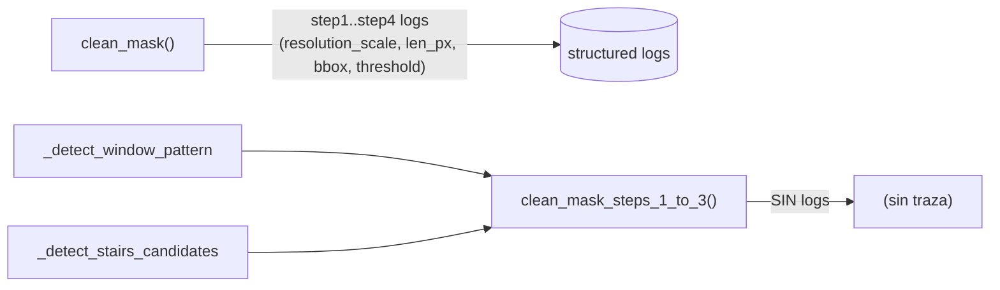

# ADR-016 — Trazabilidad diagnóstica del pipeline de limpieza de máscara

> Milestone: run 09 (fidelidad CV — segmentación) | Motivado por: defecto P3 de fidelidad geométrica (diagnóstico y no-regresión de los cambios P0/P1)

## Status
Accepted

## Context

Los defectos P0 (ADR-014) y P1 (ADR-015) fueron diagnosticables solo porque hubo
que **razonar el branch de código a mano** a partir de la resolución del fixture
(1346px → branch fijo → kernel 150px). El pipeline `clean_mask`
(`src/vitrina_cv/mask_cleanup.py:405`) emite logs por paso, pero con dos
deficiencias que hacen costoso el diagnóstico y frágil la no-regresión:

1. **Asimetría de logging entre las dos entradas.** `clean_mask` (líneas 440-550)
   registra `cv_cleanup_step1..step4` con `resolution_scale`, `applied`,
   `rectilinear_len_px_used`, `crop_bbox_xywh` y `effective_threshold_px`. Su
   gemela `clean_mask_steps_1_to_3` (líneas 555-613) — usada por la detección de
   ventanas y de escaleras (`_detect_window_pattern`, `_detect_stairs_candidates`)
   — **no emite ningún log**. Cuando esa ruta produce un defecto de fidelidad, no
   hay traza de qué kernel/branch se aplicó.

2. **El branch tomado no es explícito de forma uniforme.** Hoy `applied: True/False`
   y `adaptive: True` aparecen en algunos logs pero no en todos los caminos; el
   diagnóstico de P0 requirió deducir que `resolution_scale_raw <= max_res_scale`.
   Un log que nombre el branch de forma canónica (`fixed` / `adaptive` / `skip`)
   junto con las entradas de la fórmula (`long_side`, `min_hw`, `upscale_target`)
   habría hecho el diagnóstico inmediato.

Con los cambios P0/P1 introduciendo una fórmula adaptativa también en baja-res y un
crop multi-componente, la superficie de "¿por qué esta máscara salió así?" crece.
Sin trazabilidad simétrica y explícita, cada regresión futura vuelve a costar el
razonamiento manual del branch. Este es un defecto de **observabilidad del dominio**,
no de geometría — pero es el que sostiene la validación de los otros dos.

**Estado actual del logging (evidencia):**

## Decision

Unificar y completar la trazabilidad diagnóstica del pipeline de limpieza sin
cambiar ningún comportamiento de procesamiento. Invariantes (no implementación):

- **Simetría:** `clean_mask_steps_1_to_3` emite los mismos logs por paso que
  `clean_mask` para los pasos 1-3 (step1 small-components, step2 rectilinear,
  step3 crop). La ruta de ventanas/escaleras deja de ser una caja negra.
- **Branch canónico explícito:** el log de step2 incluye un campo `branch` con
  valor de un conjunto cerrado (`fixed` | `adaptive` | `skip`), además de los
  insumos de la fórmula (`long_side`, `min_hw`, `upscale_target_px`,
  `rectilinear_len_px_used`, `min_len_px`). El log de step3 incluye el nuevo campo
  `significant_components_count` y `crop_bbox_xywh` (envolvente, ADR-015).
- **Sin cambio de comportamiento:** este ADR solo agrega/uniformiza logs; ningún
  branch, umbral ni geometría cambia por su causa. Es puramente observabilidad.
- **Nivel y formato:** INFO estructurado vía `extra={...}`, consistente con el
  patrón existente (`_logger.info("cv_cleanup_stepN_...", extra={...})`). No se
  introduce dependencia nueva ni sink nuevo.
- **Campos como enums/valores, no strings libres:** `branch` es un valor de un
  conjunto cerrado, nunca prosa (facilita el filtrado en el harness de eval).

**Alternativas consideradas:**

- **(a) No hacer nada / diagnosticar caso a caso.** Descartada: cada regresión
  futura de P0/P1 vuelve a costar el razonamiento manual del branch, y la ruta
  `steps_1_to_3` seguiría ciega.
- **(b) Volcar máscaras intermedias a disco para inspección.** Pro: máxima
  visibilidad. Contra: I/O en el hot path, viola la pureza sin efectos de las
  funciones de `mask_cleanup` (docstring líneas 21-23), y solo se necesita en
  diagnóstico. Descartada como default; el harness `eval/tools/diag_mask.py` ya
  cubre la inspección offline de máscaras cuando hace falta.
- **(c) Logging estructurado simétrico + branch canónico (elegida).** Costo mínimo,
  cero cambio de comportamiento, habilita filtrado determinístico en el gate de
  regresión de ADR-014/015.

## Consequences

**Positivas:**

- El branch y los insumos de la fórmula quedan en la traza: diagnosticar un defecto
  de fidelidad futuro no requiere razonar el código a mano.
- La ruta de ventanas/escaleras (`clean_mask_steps_1_to_3`) deja de ser una caja
  negra — misma trazabilidad que la ruta principal.
- El gate de regresión de ADR-014/015 puede filtrar por `branch=fixed`/`adaptive` y
  por `rectilinear_len_px_used` para verificar que el kernel efectivo es el
  esperado en cada fixture, sin correr un debugger.

**Negativas / Trade-offs aceptados:**

- Ligero aumento de volumen de logs (dos rutas en vez de una). Aceptable: son logs
  INFO por request de extracción, no por pixel; el volumen es del orden de ~6-8
  líneas por imagen.
- Duplicación de la lógica de logging entre las dos funciones (ya duplican la de
  procesamiento). Mitigación: el developer puede extraer un helper puro de logging;
  este ADR no lo prescribe, fija solo los campos e invariantes.

## Implementation notes

- Los cambios viven en `src/vitrina_cv/mask_cleanup.py`, funciones `clean_mask`
  (líneas 440-550) y `clean_mask_steps_1_to_3` (líneas 587-611). Ningún archivo
  NEW. Justificación: es completar el logging existente en su propio módulo.
- El developer decide si extrae un helper de logging compartido; este ADR fija los
  nombres de evento (`cv_cleanup_step1_small_components`,
  `cv_cleanup_step2_rectilinear`, `cv_cleanup_step3_crop`) y el conjunto cerrado de
  `branch` (`fixed` | `adaptive` | `skip`). No prescribe strings de mensaje.
- Sin env var nueva: la observabilidad es incondicional (no gated). Si se requiere
  desactivar, el control es el nivel de logging global de la app, no un flag propio.
- Referencia cruzada: este ADR es la contraparte de observabilidad de ADR-014
  (branch/kernel) y ADR-015 (significant_components_count/envolvente). Su valor se
  realiza en el gate de regresión compartido por los tres.
