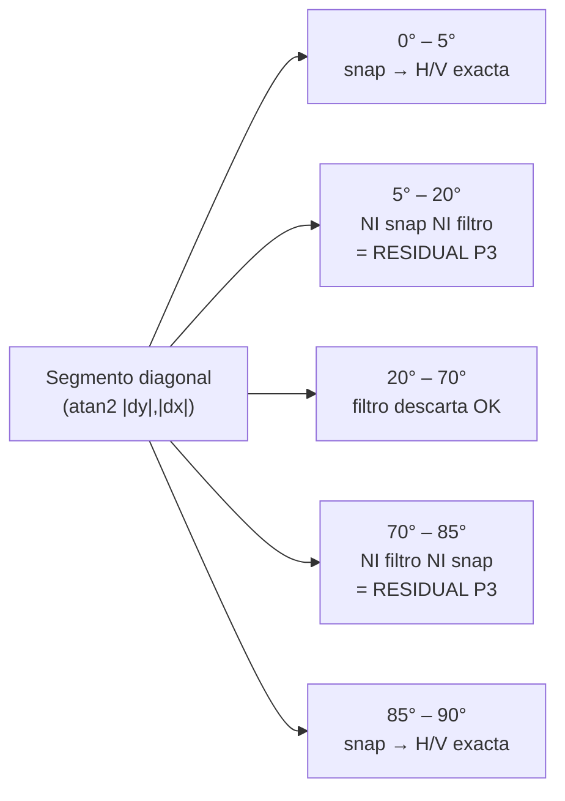

# ADR-017 — Filtro de diagonal residual robusto a la incertidumbre del ángulo del stub

> Milestone: run 09 (fidelidad CV — segmentación) | Motivado por: defecto P3 de fidelidad geométrica (diagonal residual que sobrevive al pipeline de muros)

## Status
Accepted

## Context

El defecto P3 es una **diagonal residual**: en plan-002/004/005 sobrevive al pipeline
un segmento de muro claramente diagonal (típicamente un stub de escalera o de puerta
seccional ~45°) que el filtro diagonal de 08-cv-01 debería haber descartado, o bien un
stub corto que termina proyectado como muro ortogonal fantasma. El filtro existe
(`_consolidate_walls`, `src/vitrina_cv/engines/opencv_classic.py:1255-1280`) pero no
elimina este remanente.

**Evidencia de código verificada (no un ADR viejo):**

- Defaults reales en `src/vitrina_cv/config/settings.py:394-414`:
  `cv_wall_diagonal_filter_low_deg = 20.0`, `cv_wall_diagonal_filter_high_deg = 70.0`.
  El filtro descarta la banda **`[20°, 70°]`** de `atan2(|dy|,|dx|)`.
- El filtro corre en `_consolidate_walls`, **antes** de `_snap_walls_orthogonal` y de
  `_fuse_junctions`. Orden efectivo (opencv_classic.py:2304-2314):
  `_consolidate_walls → _snap_walls_orthogonal → _extend_to_intersection → _fuse_junctions`.
- `_snap_walls_orthogonal` fuerza a H/V exacta todo segmento con ángulo
  `< _SNAP_ANGLE_TOL_DEG = 5.0` respecto de un eje (opencv_classic.py:292, 1371-1377).

De esas tres constantes se deduce **dónde vive geométricamente la diagonal residual**,
sin necesidad de correr el pipeline:



La banda muerta **`[5°, 20°) ∪ (70°, 85°]`** es la que produce el residual: un stub
ahí no lo toca el snap (>5° del eje) ni el filtro diagonal (fuera de `[20,70]`), así que
sobrevive como "diagonal legítima" aunque sea ruido de escalera/puerta.

**Incertidumbre no resuelta en esta sesión (riesgo explícito):** no dispongo del
ángulo exacto medido del stub en plan-002/004/005. El harness `eval/tools/diag_mask.py`
existe pero **no hay logs ni reportes de eval persistidos en el repo** (`eval/` no
contiene JSON de corridas previas) y **no tengo Bash para ejecutar el pipeline**. Por
tanto no puedo confirmar cuál de dos causas domina:

- **(C1) Stub casi-ortogonal en la banda muerta** — ángulo en `[5°,20°)` o `(70°,85°]`:
  simplemente subir/ampliar la banda del filtro lo captura, PERO ampliar hasta ~5°
  empieza a solaparse con muros reales ligeramente torcidos que el snap sí debe rescatar.
- **(C2) Stub que ya cae en `[20,70]` pero reaparece post-snap/fuse** — p.ej. dos
  fragmentos que tras `_extend_to_intersection`/`_fuse_junctions` reconstituyen un tramo
  oblicuo, o un stub corto de escalera con ángulo dentro de banda que el filtro sí borra
  pero cuyo gemelo sobrevive. Mover/ampliar el filtro pre-snap no lo resuelve.

Apostar a un solo mecanismo es frágil frente a esta bifurcación: si elijo "ampliar la
banda" y la causa real es C2, el defecto persiste; si elijo "segundo pase post-fuse" y
la causa es C1, la banda muerta `[5,20)` sigue abierta.

## Decision

Adoptar un **criterio de doble mecanismo dentro de la misma decisión**, robusto a que la
causa sea C1 o C2, en lugar de apostar a mover un único umbral. Ambos mecanismos son
invariantes de comportamiento; el developer elige la implementación.

**Mecanismo 1 — Segundo pase del filtro por ángulo después de `_fuse_junctions`.**
Tras `_snap_walls_orthogonal → _extend_to_intersection → _fuse_junctions`, re-evaluar el
ángulo de cada `Wall` sobreviviente y descartar los que caen en la banda de descarte.
Cubre C2 (residual que solo se materializa post-snap/fuse) y es idempotente sobre la
salida del primer pase (los muros ya snapeados son H/V exactos → ángulo 0° o 90° → nunca
caen en la banda, no hay riesgo de borrar muros buenos).

- Invariante: el segundo pase usa la **misma** banda `[low_deg, high_deg]` que el primero
  (mismas env vars `cv_wall_diagonal_filter_low_deg/high_deg`), no una banda nueva.
- Invariante: gated por la misma `cv_wall_diagonal_filter_enabled`. Con el flag en False,
  ni el primer ni el segundo pase corren (compat pre-08 intacta, AC-3 de 08-cv-01).

**Mecanismo 2 — Filtro por longitud mínima aplicado SOLO a remanentes oblicuos.**
Un `Wall` que (a) no es H/V exacto tras el snap **y** (b) tiene longitud euclidiana
`< cv_wall_min_diagonal_len_px` (NEW) se descarta. Cubre C1 y la banda muerta `[5,20)∪(70,85]`:
un stub de escalera/puerta en esa banda es corto por naturaleza; un muro diagonal genuino
es largo. El filtro NO se aplica a muros ortogonales (esos ya pasaron snap y su longitud
no es criterio de validez), evitando borrar muros H/V cortos legítimos.

- Invariante: el filtro de longitud aplica **únicamente** a segmentos con ángulo fuera de
  la tolerancia de snap respecto de ambos ejes (es decir, oblicuos que sobrevivieron). Un
  muro exacto H/V nunca es candidato, sin importar su longitud.
- Invariante: `cv_wall_min_diagonal_len_px` calibrado para imágenes normalizadas a ~2000px
  (convención dura del proyecto: todo umbral en px se calibra a 2000px y se documenta así).
  Default propuesto conservador; el developer ajusta contra el dataset de eval.
- Invariante: gated por `cv_wall_diagonal_filter_enabled` (mismo master switch — no se
  introduce un segundo flag que multiplique la matriz de estados).

**Orden efectivo resultante del pipeline de muros:**

```
_consolidate_walls (filtro banda — pase 1)
  → _snap_walls_orthogonal
  → _extend_to_intersection
  → _fuse_junctions
  → filtro banda (pase 2, Mec. 1) + filtro long. mínima de oblicuos (Mec. 2)
```

**Alternativas consideradas y descartadas:**

- **(a) Solo mover/ampliar la banda `[low,high]` hacia `[5,85]`.** Descartada: no cubre
  C2, y ampliar hasta 5° roza la tolerancia de snap (5°), arriesgando borrar muros reales
  ligeramente torcidos que el snap debía rescatar. Frágil ante la incertidumbre.
- **(b) Solo el segundo pase por ángulo (Mec. 1 sin Mec. 2).** Descartada: deja abierta la
  banda muerta `[5,20)∪(70,85]` — si la causa es C1 (stub casi-ortogonal corto), persiste.
- **(c) Bajar la tolerancia de snap para "absorber" el stub.** Descartada: cambia el
  comportamiento de F4 (ADR-013), con riesgo de regresión en junctions ya validados.
- **(d) Doble mecanismo — banda idempotente post-fuse + longitud mínima de oblicuos
  (elegida).** Robusta a que la causa sea C1 o C2 sin necesidad de medir el ángulo exacto
  del stub, que no puedo obtener en esta sesión.

## Consequences

**Positivas:**

- El defecto P3 se resuelve **con independencia de si la causa real es C1 o C2** — no se
  bloquea la decisión esperando un dato (ángulo exacto del stub) que no es obtenible aquí.
- Mec. 1 es idempotente y sin riesgo sobre muros ortogonales (ángulo 0°/90° post-snap
  nunca cae en la banda) → cero regresión sobre plantas rectilíneas contiguas.
- Mec. 2 discrimina ruido de muro genuino por longitud, un criterio ortogonal al ángulo,
  cerrando la banda muerta que ni snap ni filtro-banda cubren.
- Ambos mecanismos comparten el master switch existente: con el flag en False el
  comportamiento pre-08 queda idéntico (no se multiplica la matriz de configuración).

**Negativas / Trade-offs aceptados:**

- Un muro **diagonal genuino y corto** (raro en plantas rectilíneas, dominio objetivo del
  motor) podría descartarse por Mec. 2. Aceptable: el motor es rectilíneo-orientado y ya
  descarta diagonales genuinas por diseño (ver `settings.py:200-211`, paso 2 cleanup).
- El segundo pase re-evalúa ángulos ya evaluados (costo O(n) sobre pocos muros
  consolidados). Despreciable frente al costo del pipeline morfológico.
- Se introduce un umbral nuevo (`cv_wall_min_diagonal_len_px`), aumentando la superficie
  de configuración. Mitigado: reusa el master switch y sigue la convención de env var por
  umbral, documentada en `docker-compose-local.yml`.
- **Riesgo residual documentado:** el default de `cv_wall_min_diagonal_len_px` se fija sin
  el ángulo/longitud medidos del stub. La calibración final contra plan-002/004/005 queda
  como validación del developer/tester con el harness `eval/tools/diag_mask.py`; si tras
  medir se confirma que la causa es puramente C2, Mec. 2 queda como red de seguridad
  inactiva (no daña), no como código muerto a remover.

## Implementation notes

- Cambios en `src/vitrina_cv/engines/opencv_classic.py`: (i) extraer la lógica de descarte
  por banda del bloque `_consolidate_walls:1255-1280` de forma reutilizable para el pase 2
  tras `_fuse_junctions` (línea 2314); (ii) aplicar el filtro de longitud a oblicuos en el
  mismo pase 2. Ningún archivo NEW. Justificación: es completar el filtro de 08-cv-01 en su
  propio módulo, junto a las fases F3/F4 que ya viven ahí.
- Nueva env var `cv_wall_min_diagonal_len_px` en `src/vitrina_cv/config/settings.py`
  (sección "Wall diagonal filter (08-cv-01)", junto a `cv_wall_diagonal_filter_*`).
  Documentar en `docker-compose-local.yml` (repo `vitrina`). Nunca hardcodear (convención
  dura del módulo).
- Invariante de log (alineado con ADR-016): el pase 2 emite un evento estructurado con
  `count` de descartes por ángulo y por longitud como campos separados (valores, no prosa),
  para que el gate de eval distinga qué mecanismo actuó en cada fixture.
- Referencia cruzada: no toca `_snap_walls_orthogonal` ni el orden de F4 (ADR-013); solo
  añade un pase posterior. La banda y el master switch son los de 08-cv-01.
