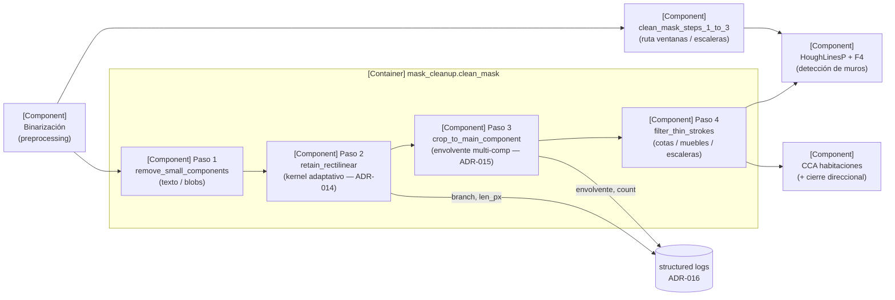
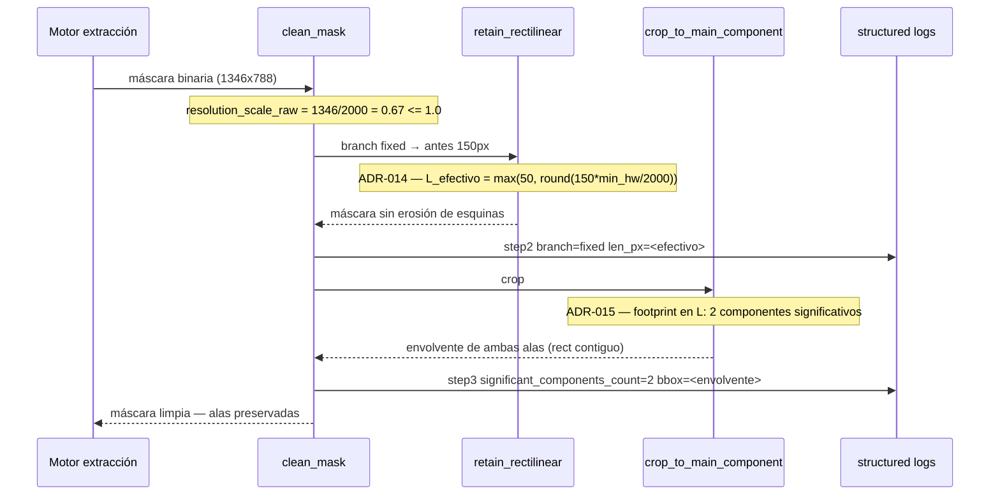
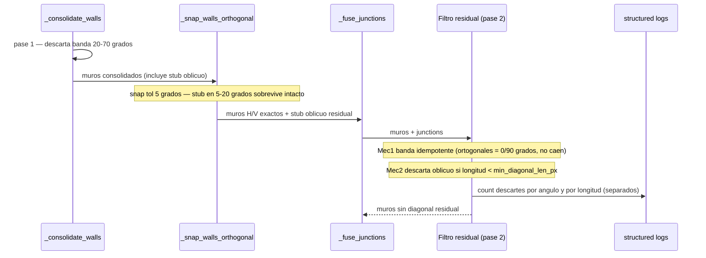

# Architecture View — backend (pipeline de limpieza de máscara)

> Feature: run 09 — fidelidad CV / segmentación | Milestone: run 09

Perspectiva: la fase de limpieza de máscara de `vitrina-cv` que antecede a la
detección de muros y habitaciones, más el filtro de diagonal residual de la fase de
consolidación de muros (F3/F4). Cubre los cambios de los defectos P0/P1/P3
(ver ADR-014, ADR-015, ADR-016, ADR-017). Documenta la estructura estable del módulo,
no el scope del run (eso vive en el spec).

## 1. Vista (C4 — componentes del módulo mask_cleanup)



## 2. Componentes principales (blackbox)

| Componente / path | Responsabilidad | Depende de | Expuesto a |
|---|---|---|---|
| `remove_small_components` (`mask_cleanup.py:83`) | Elimina componentes con bbox pequeño en ambas dimensiones (texto, cotas cortas) | `cv2.connectedComponentsWithStats` | `clean_mask`, `clean_mask_steps_1_to_3` |
| `retain_rectilinear` (`mask_cleanup.py:120`) | Open direccional H/V que suprime achurado; **kernel dimensionado a la resolución normalizada** (ADR-014) | `Settings.cv_cleanup_rectilinear_len_px`, `..._min_len_px` (NEW), `..._max_res_scale` | `clean_mask`, `clean_mask_steps_1_to_3` |
| `crop_to_main_component` (`mask_cleanup.py:249`) | Recorta a la **envolvente de los componentes significativos** (ADR-015), no solo al mayor | `Settings.cv_cleanup_crop_margin_px`, `..._crop_min_area_ratio` (NEW) | `clean_mask`, `clean_mask_steps_1_to_3` |
| `filter_thin_strokes` (`mask_cleanup.py:156`) | Reconstrucción geodésica acotada; retiene cores gruesos de muro | `Settings.cv_cleanup_min_wall_thickness_px`, `..._preclose_px` | `clean_mask` |
| `clean_mask` (`mask_cleanup.py:405`) | Orquesta pasos 1→4; emite logs por paso (ADR-016) | los cuatro pasos, `Settings` | motor de extracción (wall/room) |
| `clean_mask_steps_1_to_3` (`mask_cleanup.py:555`) | Pasos 1→3 preservando trazos finos; **logging simétrico** (ADR-016) | pasos 1-3, `Settings` | detección de ventanas / escaleras |

## 3. Runtime View (escenario P0/P1 — plan-001 baja-res no contiguo)



### Runtime View — P3 diagonal residual (plan-002/004/005, ADR-017)



## 4. Atributos de calidad relevantes

- **Correctitud (fidelidad geométrica):** plan-001 recupera sus 12 habitaciones y
  áreas contra `eval/dataset/plan-001-denso-achurado/ground_truth.json`. Ver ADR-014,
  ADR-015. Gate: no-regresión sobre plan-002..005.
- **No-regresión (invariante de compatibilidad):** kernel y crop son no-op sobre
  plantas rectangulares contiguas calibradas a ~2000px (ADR-014, ADR-015). El filtro
  de diagonal residual (ADR-017) es no-op sobre muros H/V exactos: su segundo pase por
  banda es idempotente (ángulo 0°/90° nunca cae en `[20,70]`) y el filtro por longitud
  aplica solo a segmentos oblicuos sobrevivientes, nunca a ortogonales.
- **Observabilidad:** ~6-8 líneas INFO estructuradas por imagen; branch canónico
  (`fixed`|`adaptive`|`skip`) y kernel efectivo trazados en ambas rutas (ADR-016).
- **Latencia:** impacto despreciable — los cambios son de dimensionamiento de
  kernel y selección de componentes, del mismo orden que las operaciones
  morfológicas ya presentes; sin I/O nuevo.
- **Configurabilidad:** todo umbral vía env var (`CV_CLEANUP_RECTILINEAR_MIN_LEN_PX`,
  `CV_CLEANUP_CROP_MIN_AREA_RATIO`, NEW) — convención dura del módulo, nunca
  hardcodeado. Documentar en `docker-compose-local.yml` (repo `vitrina`).
```
